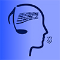

### Hi there 👋 I'm Marco

I'm an Indie Full Stack Developer and the founder of **appinhand.it**, where I build digital tools to help people learn and improve their skills.

---

### 🚀 My Projects

Here are some of the apps I've built and currently maintain:

| Icon | App | Description | Download |
| :--- | :--- | :--- | :--- |
|  | **ChordQuest** | A practice tool for musicians to build muscle memory and master chord changes. |  |
|  | **Chess - PGN Annotator** | An Android app for annotating your chess games. |  |

---

### 🛠️ Tech & Tools I Use

*   **Languages:** Php, Html, Css, Javascript, Typescript, jQuery, SQL, C#, C++, Rust, VB, Python, Java, Kotlin, Assembly
*   **Platform:** Android (Android SDK, Jetpack), .NET, Nodejs, Spring Boot, Docker, Xampp, Arduino
*   **Libraries:** Room, Coroutines, Flow, etc., React, Bootstrap
*   **Tools:** Android Studio, Visual Studio, Visual Studio Code, Notepad++, PhpMyAdmin, MySQL, PostgreSQL, MariaDB, Wordpress, Arduino, Ghidra, IDA, x96dbg

---

### 📫 Find me here:

*   **Reddit:** <a href="https://www.reddit.com/user/AppInHand_Dev/">AppInHand_Dev</a>
*   **Lichess:** <a href="https://lichess.org/@/MMrRobot/">MMrRobot</a>
*   **Chess.com:** <a href="https://www.chess.com/member/mmrrobot/">MMrRobot</a>
*   **Website:** appinhand.it
